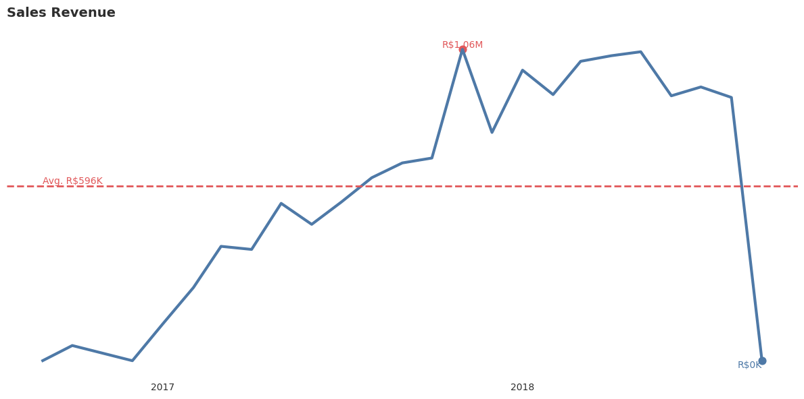
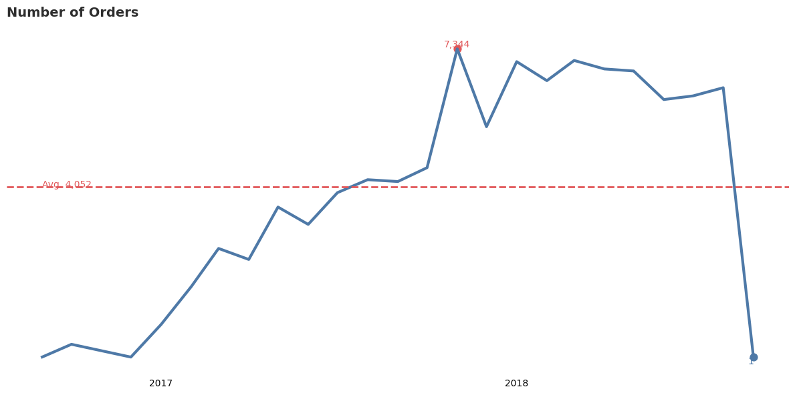
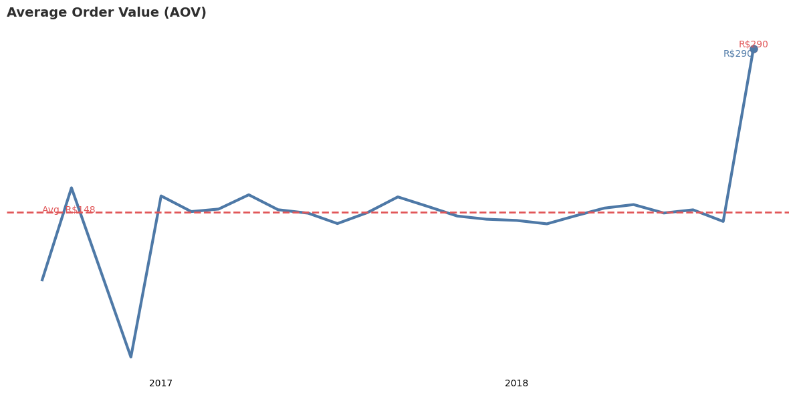
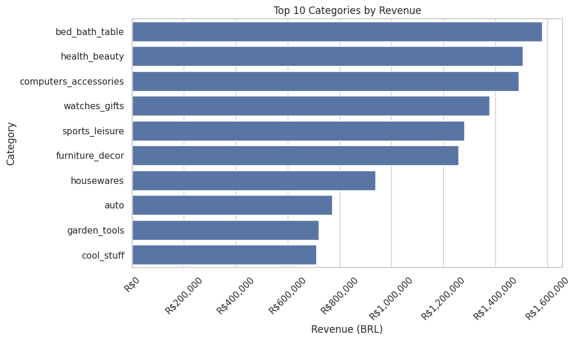
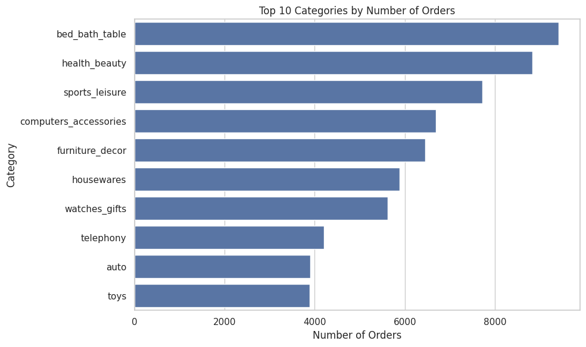
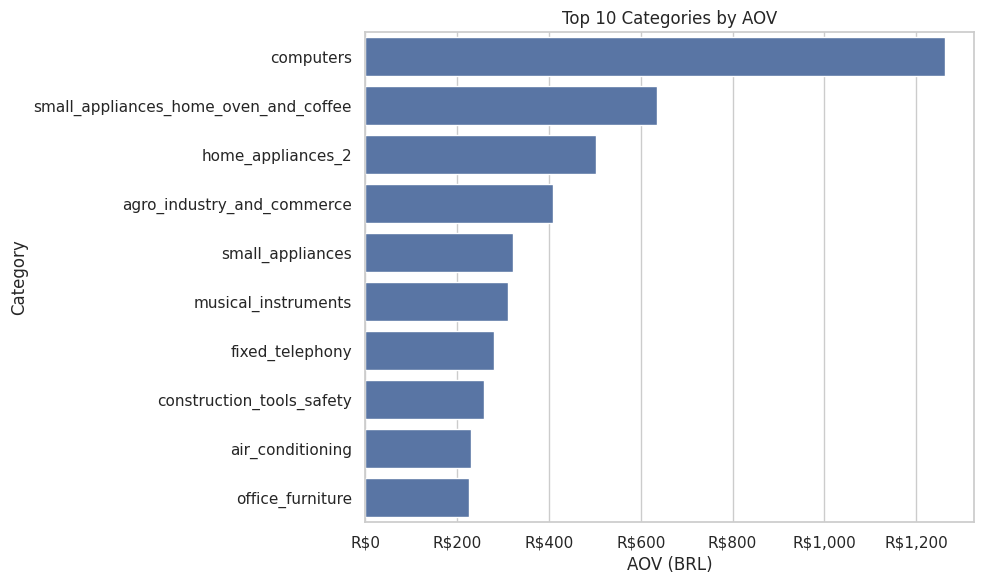
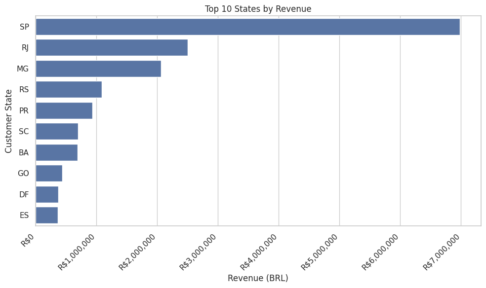

## Business Overview

This project analyzes a Brazilian e-commerce dataset consisting of approximately **100,000 orders** and **over 90,000 customers**, generating total sales revenue exceeding **R$18 million**. The dataset captures multiple dimensions of the business, including transactional data, product categories, payment values, and customer geographic information.

An in-depth analysis was conducted to evaluate the company’s performance over the observed period (2016–2018). The objective of this analysis is to identify key revenue drivers, understand customer purchasing behavior, and uncover patterns across product categories and geographic regions.

This analysis aims to provide actionable insights that can support business decision-making, particularly in optimizing product strategy, improving revenue quality, and identifying high-performing markets. The findings are intended to help stakeholders better understand where the business is performing well and where there are opportunities for growth or improvement. 

The key insights and recommendations focus on the following areas:
- **Sales Trend Analysis** - focuses on how the business evolves over time by examining revenue, number of orders, and average order value (AOV). This helps identify growth phases, peak periods, and signs of stabilization.

- **Product Category Performance** - explores how different product categories contribute to the business. It highlights which categories drive revenue, which rely on high transaction volume, and which represent high-value but lower-frequency purchases.

- **Regional Performance Analysis** - focuses on revenue distribution across customer states. This provides insight into geographic concentration, identifies core markets, and reveals potential areas for expansion based on regional demand patterns.

## Data Dictionary

The dataset contains **111,015 rows**, structured at the **item level**, meaning each row represents a single product within an order. As a result, one `order_id` may appear multiple times depending on the number of items purchased in that order.

| Column Name                     | Description |
|--------------------------------|-------------|
| order_id                       | Unique identifier for each order. One order can contain multiple items. |
| order_status                   | Current status of the order (e.g., delivered, shipped, canceled). |
| order_purchase_timestamp       | Timestamp when the order was placed by the customer. |
| order_approved_at              | Timestamp when the payment for the order was approved. |
| order_delivered_carrier_date   | Timestamp when the order was handed over to the logistics carrier. |
| order_delivered_customer_date  | Timestamp when the order was delivered to the customer. |
| order_estimated_delivery_date  | Estimated delivery date provided at the time of purchase. |
| customer_id                    | Unique identifier for each customer order (can repeat for same customer). |
| customer_unique_id             | Unique identifier for each customer (consistent across multiple orders). |
| customer_city                  | City where the customer is located. |
| customer_state                 | State (region) where the customer is located. |
| customer_zip_code_prefix       | Prefix of the customer’s zip code. |
| order_item_id                  | Item sequence number within an order (indicates multiple items per order). |
| freight_value                  | Shipping cost paid for the item. |
| price_x                        | Price of the product item (excluding shipping). |
| product_category_name_english  | Product category in English. |
| product_id                     | Unique identifier for each product. |
| shipping_limit_date            | Deadline for the seller to ship the order. |
| delivery_time                  | Time taken from shipment to delivery. |
| delay_status                   | Indicator of whether the delivery was on time or delayed. |
| profit                         | Estimated profit from the order or item. |
| order_month                    | Month when the order was placed. |
| order_year                     | Year when the order was placed. |
| total_spending                 | Total amount spent by the customer for the order. |
| total_order                    | Total number of orders associated with the customer or transaction. |

## Insight Deep-Dive

## Sales Trend

  
  
  

### Sales Revenue

1. Peak Growth Followed by Stabilization (2017–2018)  
   - Revenue grew rapidly in 2017:
     - **R$126K (Jan 2017) → R$1.06M (Nov 2017)**  
     - Driven by customer acquisition and promotions  
   - In 2018:
     - Stabilized at **R$900K – R$1.05M/month**  
     - Indicates transition to a **mature business stage**

2. November 2017 Surge – Campaign-Driven Spike  
   - Highest revenue recorded: **R$1.06M**  
   - Driven by:
     - Black Friday / seasonal campaigns  
     - Significant increase in transaction volume  
   - Insight:
     - Growth is **event-driven**, not organic  
     - Indicates reliance on promotions  

3. Revenue Stability Without Strong Growth Signal  
   - 2018 shows:
     - High but flat revenue  
     - No sustained upward trend  
   - Implications:
     - Slowing business expansion  
     - Increasing dependence on campaigns  
     - Risk of stagnation  

---

### Average Order Value (AOV)

1. Gradual Decline in AOV Over Time  
   - AOV trend:
     - ~**R$160 (early 2017)** → **R$137–150 (2018)**  
   - Indicates:
     - Lower spending per transaction  
     - Possible:
       - Increased discounting  
       - Shift to lower-priced products  

2. Stable but Not Driving Growth  
   - AOV remains relatively stable despite decline  
   - Insight:
     - AOV is **not the main driver of revenue**  
     - Revenue changes are driven by **order volume**

3. Declining Transaction Value and Price Sensitivity  
   - AOV decline suggests:
     - Increased price sensitivity  
     - Shift toward lower-value purchases  
     - More competitive pricing  

---

### Number of Orders

1. Strong Growth as Primary Revenue Driver  
   - Orders increased significantly in 2017:
     - **778 (Jan) → 7,344 (Nov)**  
   - Insight:
     - Revenue growth driven by **volume**, not value  

2. November 2017 Peak – Volume-Driven Growth  
   - Orders peak aligns with revenue peak  
   - Confirms:
     - Growth driven by **more transactions**  
     - Not higher spending per order  

3. Stabilization in 2018  
   - Orders stabilize at **6,000 – 7,000/month**  
   - Indicates:
     - Business plateau  
     - No further volume growth  
     
## Product Category Performance

  
  
  

### The Best and Worst  

1. Top Revenue-Driving Categories  
   - **bed_bath_table** leads with ~**R$1.58M**  
   - Followed by:
     - **health_beauty (~R$1.50M)**  
     - **computers_accessories (~R$1.49M)**  
   - These categories:
     - Combine high demand + consistent transactions  
     - Act as **core revenue drivers**

2. Strong Mid-Top Performers  
   - **watches_gifts** and **sports_leisure** each contribute **>R$1.2M**  
   - Indicate strong commercial relevance  

3. Low-Performing Categories  
   - **security_and_services**, **fashion_childrens_clothes**, **cds_dvds_musicals**  
   - Generate **<R$1K revenue**  
   - Indicate:
     - Extremely low demand  
     - Limited market relevance  

4. Mid-Level but Under-Optimized  
   - Categories like **auto** and **garden_tools**:
     - Generate moderate revenue  
     - Not among top performers  
   - Suggest:
     - Potential for optimization  

---

### Volume vs Value Dynamics  

1. High Volume Categories  
   - **bed_bath_table**, **health_beauty**, **sports_leisure**  
   - Characteristics:
     - **7,000–9,000+ orders**  
     - Revenue driven by **transaction frequency**  
     - Not high per-order value  

2. High Value Categories  
   - **watches_gifts**, **computers_accessories**  
   - Characteristics:
     - Lower order volume  
     - Strong revenue contribution  
     - Higher value per transaction  

3. Low Efficiency Categories  
   - **toys**, **auto**, **telephony**  
   - Characteristics:
     - Moderate order volume  
     - Low revenue contribution  
   - Indicate:
     - Lower pricing  
     - Smaller basket size  

---

### AOV Insights  

1. Premium Category (Highest AOV)  
   - **computers (~R$1,262)**  
   - Characteristics:
     - Extremely high transaction value  
     - Lower purchase frequency  

2. High AOV Categories  
   - **small_appliances_home_oven_and_coffee (~R$635)**  
   - **home_appliances_2 (~R$502)**  
   - **agro_industry_and_commerce (~R$409)**  
   - Represent:
     - High-ticket purchases  
     - Strong contribution per order  

3. Low AOV Categories  
   - **home_comfort_2 (~R$37)**  
   - **flowers (~R$42)**  
   - **cds_dvds_musicals (~R$60)**  
   - Indicate:
     - Low-priced products  
     - Impulse buying behavior  

## Regional Performance Analysis

  

### The Best and Worst  

1. Dominant Core Market  
   - **São Paulo (SP)** leads with ~**R$6.98M**  
   - Contributes **38.3% of total revenue**  
   - Acts as:
     - Primary revenue driver  
     - Core market for the business  

2. Strong Secondary Markets  
   - **Rio de Janeiro (RJ)**: ~**R$2.50M (13.7%)**  
   - **Minas Gerais (MG)**: ~**R$2.07M (11.3%)**  
   - Combined:
     - Top 3 states contribute **>63% of total revenue**  
   - Indicates:
     - High geographic concentration  

3. Mid-Tier Performing States  
   - **Rio Grande do Sul (RS)** and **Paraná (PR)**  
   - Revenue range: **R$0.9M – R$1.08M**  
   - Characteristics:
     - Moderate contribution  
     - Stable performance  

4. Low-Performing Regions  
   - **Roraima (RR)**, **Amapá (AP)**, **Acre (AC)**  
   - Revenue: **<R$25K**  
   - Indicate:
     - Very limited market presence  
     - Low demand  

---

### Revenue Distribution Patterns  

1. High Concentration in Core Regions  
   - Revenue heavily concentrated in a few states:
     - **SP alone ≈ 40%**  
     - Top 5 states contribute **>70%**  
   - Implication:
     - Strong dependency on developed regions  

---

2. Mid-Tier Regional Markets  
   - **RS, PR, SC, BA** contribute **3%–6% each**  
   - Characteristics:
     - Consistent demand  
     - Not yet saturated  
   - Opportunity:
     - Targeted expansion potential  

---

3. Long Tail Distribution  
   - Many states contribute **<2% each**  
   - Includes:
     - Northern regions (**AM, AP, RR**)  
     - Less populated areas  
   - Indicates:
     - Limited market penetration  
     - Possible logistical / economic constraints  

---

### Regional Imbalance  

1. Centralized Revenue Structure  
   - Revenue heavily dependent on a few key states  
   - Especially **São Paulo (SP)**  

2. Risk Implication  
   - Performance drop in SP would:
     - Significantly impact total revenue  
     - Increase business vulnerability
    
## Recommendations

Based on the uncovered insights, here are actionable steps to improve business performance:

### Sales

- Reduce dependency on seasonal spikes (e.g., November campaigns) by strengthening **always-on marketing strategies**.  
  - Current growth is heavily driven by promotional events rather than consistent demand.

- Increase revenue quality by improving **Average Order Value (AOV)**.  
  - Revenue is currently driven by order volume, not transaction value.  
  - Apply upselling, cross-selling, and product bundling.

- Prevent stagnation by expanding beyond current growth plateau.  
  - Explore new acquisition channels and optimize pricing strategies.

---

### Product Categories

- Maximize high-volume categories (e.g., bed_bath_table, health_beauty).  
  - Increase AOV through bundling and promotions.

- Leverage high-value categories (e.g., computers, home appliances).  
  - Promote premium products and offer installment/payment options.

- Re-evaluate low-performing categories.  
  - Categories with low volume and low value contribute minimally to revenue.

---

### Regional

- Reduce reliance on São Paulo (SP) as the primary revenue source.  
  - SP contributes ~38% of total revenue.

- Expand in mid-tier regions (RS, PR, SC, BA).  
  - These regions show consistent demand and growth potential.

- Improve penetration in low-performing regions.  
  - Focus on logistics, localized marketing, and pricing strategies.
